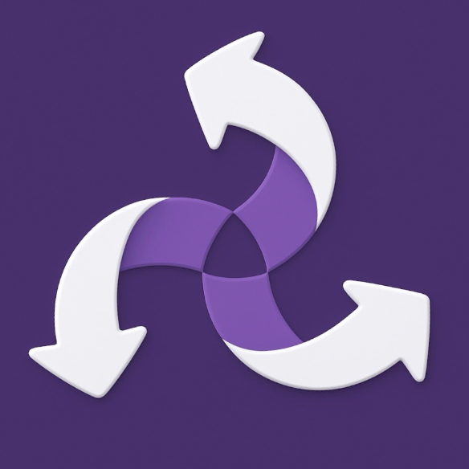
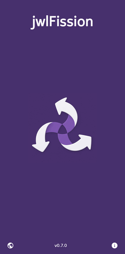
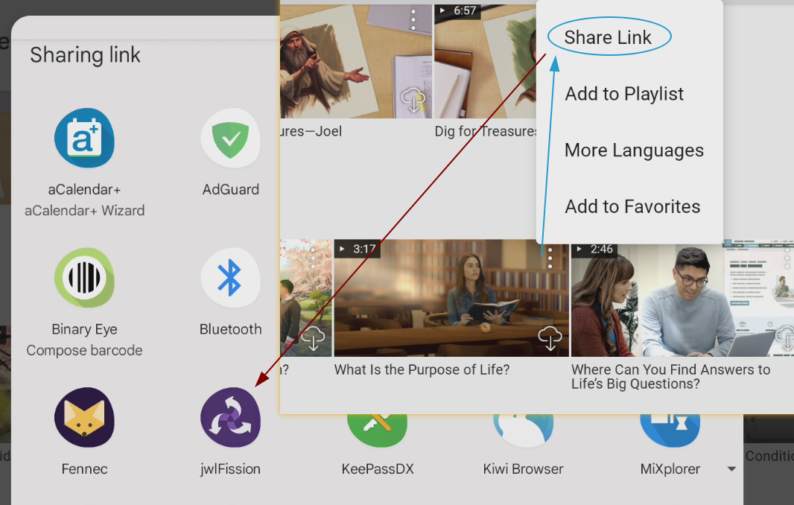
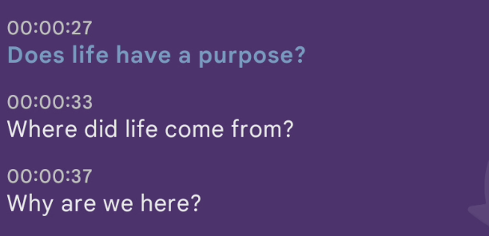
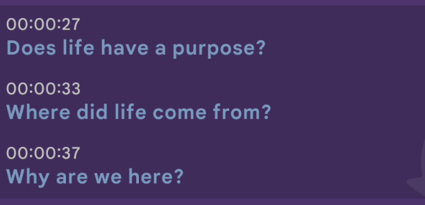

#  jwlFission App

This is an **Android app**[^1] to view the subtitle (transcript) files associated with videos in *JW Library*[^2] and on [JW.ORG](https://jw.org).

It allows:
- Saving/sharing the subtitle file locally
- Copying a portion of the text to clipboard
- Switching to another available language
- Generating a link to a portion of the video

Preview…
 

 

How to use…
 

To begin with, share a video link from *JW Library* (or the [JW.ORG](https://jw.org) website) to *jwlFusion*:

If the video contains subtitles, the transcript page will open and you should see the text along with a toolbar at the top:

  decrease and increase the text font size

 toggle timestamps off/on

 tap: share subtitle file (to Google Drive, for example); tap-and-hold (long-click): save subtitle file to local file system; in both cases, with or without timestamps (depending on toggle state)

  after search is performed using the search box, jump to previous or next search result

Nothing selected:

Single subtitle selected (start frame only):

Subtitle range selected - shaded (start and end frames):

 copy selection to clipboard - with or without timestamps (depending on toggle state)

 clear selection

 switch to another language; recently selected languages listed first; then "top" languages; then remaining available languages; if there was a selection on language switch, the approximate location will be selected in the new language

 tap: launch link to video in the *current* language (intercepted and played in *JW Library* if installed, else in browser); tap-and-hold (long-click): copy link to clipboard; in both cases, if there was a start frame, video will play starting at that location; if there was an end frame, video will play only the selected frames

 

____

By using this software you agree to abide by the terms of its [License](LICENSE.txt).

Feel free to get in touch and post any [issues and/or suggestions](https://github.com/erykjj/jwlFission-app/issues).

My other *JW Library* projects: [**JWLManager**](https://github.com/erykjj/jwlmanager), [**jwlFusion** (Android)](https://github.com/erykjj/jwlFusion-app) & [**jwlFusion** (desktop)](https://github.com/erykjj/jwlFusion)

____

#### Footnotes:
[^1]: Android 10+, arm64-v8a & x86_64

[^2]: [JW Library](https://www.jw.org/en/online-help/jw-library/) is a registered trademark of *Watch Tower Bible and Tract Society of Pennsylvania*